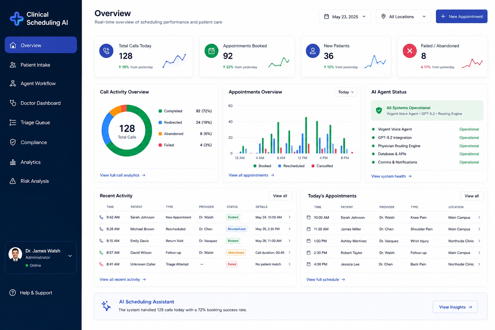
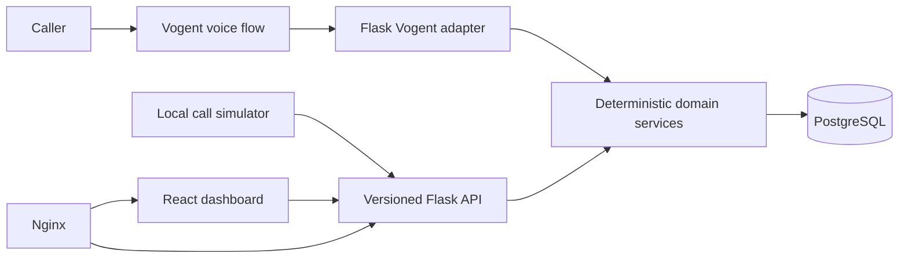

# AI Medical Scheduling Agent

A voice-ready medical scheduling platform built for a two-calendar-day engineering work trial. The system combines a Flask API, deterministic physician routing, PostgreSQL scheduling data, Vogent integration boundaries, a transactional booking workflow, and a polished React call-review dashboard.

The core design decision is deliberate: the conversational layer may collect and normalize caller information, but the backend domain layer is the final authority for physician eligibility, location validity, slot availability, and booking.



> The image above is the supplied visual reference. The application uses its layout and hierarchy as design direction without copying its branding.

## What was built

- Exact protocol encoding for 12 physicians, 3 locations, and all supplied capabilities.
- Per-physician new-patient eligibility using patient-doctor treatment history.
- Deterministic routing with preferred-doctor validation, preferred-location handling, real-slot lookup, and fallback recommendations.
- Transactional appointment booking with a final eligibility check, row locking on PostgreSQL, a unique appointment-per-slot constraint, and conflict responses.
- Patient lookup and duplicate-safe creation.
- Call lifecycle, normalized transcript turns, appointment association, and explainable routing-audit records.
- Local call simulator that invokes the same routing and booking services used by the API and Vogent adapter.
- React/TypeScript dashboard with Overview, Calls, Call Detail, Appointments, Physicians, Routing Audit, and Call Simulator pages.
- Docker Compose development and single-EC2 production deployment with PostgreSQL, Gunicorn, Nginx, health checks, and a persistent database volume.
- Vogent function-call configuration blueprints, webhook adapter, HMAC verification, variable mapping, and credential-dependent setup instructions.
- GPT-5.2 Responses API adapter with strict structured-output validation and no mock fallback in live mode.
- PostgreSQL-only normal runtime guardrails; SQLite is allowed only for explicit test configuration.
- Backend request-size limits, field-level transcript/caller-text limits, and a DB-backed fixed-window limiter for public write/integration endpoints.
- Automated backend and frontend tests, including all required routing scenarios and concurrent booking protection.

## Architecture



See [Architecture](docs/ARCHITECTURE.md), [ERD](docs/ERD.md), and [Routing Rules](docs/ROUTING_RULES.md) for the complete design.

## Technology stack

- Backend: Python 3.12+, Flask, SQLAlchemy 2.x, Alembic, PostgreSQL, Gunicorn, pytest, Ruff, mypy.
- Frontend: React, strict TypeScript, Vite, React Router, TanStack Query, Recharts, Vitest, Testing Library.
- Deployment: Docker, Docker Compose, Nginx, AWS EC2.
- Integration: Vogent function calls and signed webhooks behind an adapter boundary.

## Main scheduling flow

1. Identify or create the patient using phone and date of birth.
2. Collect patient status, body part, issue type, preferred physician, and preferred location.
3. Normalize supported caller language into canonical body-part and issue-type values.
4. Evaluate exact doctor capability rows.
5. Enforce new-patient eligibility per doctor using treatment history.
6. Prioritize valid preferred-doctor and preferred-location matches.
7. Query actual open slots and select the earliest deterministic recommendation.
8. Continue to a fallback doctor when the first valid doctor has no openings.
9. Repeat doctor, location, date, and time and require explicit confirmation.
10. Re-run eligibility and claim the slot transactionally.
11. Persist the appointment, transcript, call result, and routing decisions.

## Routing invariants

- `General` never matches `Fracture`, `Joint Replacement`, or `Sports Medicine`.
- A facility-returning patient is still new to a doctor they have never seen.
- A physician who does not accept new patients is eligible only when that patient has history with that physician.
- A slot is valid only at a location where the physician practices.
- Preferred doctors are validated rather than trusted.
- Preferred-location alternatives are explained and never booked without confirmation.
- Doctor ranking is deterministic: valid preferred doctor, preferred-location match, earliest slot, then doctor ID.
- The API never reports a booking until the database transaction succeeds.

## Repository structure

```text
.
├── backend/               Flask application, migrations, domain services, tests
├── frontend/              React dashboard and component tests
├── infra/                 Nginx and EC2 operational scripts
├── vogent/                Integration documentation and tool blueprints
├── docs/                  Architecture, API, ERD, deployment, demo, test plan
├── docker-compose.yml     Local development stack
├── docker-compose.prod.yml
├── Makefile
└── AGENTS.md
```

## Local setup with Docker

### Prerequisites

- Docker Engine with the Compose plugin
- Git

```bash
cp .env.example .env
docker compose up --build
```

The development stack is available at:

- Dashboard: `http://localhost:5173`
- API health: `http://localhost:8000/api/v1/health`

Migrations and idempotent seeding run when the backend container starts.

When changing backend environment values in the root `.env` after containers already exist, recreate the affected container so Docker injects the new values:

```bash
docker compose up -d --force-recreate backend
```

`docker compose restart backend` restarts the old container with its existing environment and may leave integration readiness stale.

## Local setup without Docker

Prerequisites: Python 3.12+, PostgreSQL 15+, Node.js 22+, and npm.

```bash
cp .env.example .env
python3 -m venv .venv
source .venv/bin/activate
pip install -e './backend[dev]'
cd frontend
npm ci
cd ..
```

Create a PostgreSQL database and set `DATABASE_URL` in `.env`, then run:

```bash
source .venv/bin/activate
set -a
source .env
set +a
cd backend
alembic upgrade head
flask --app app:create_app seed
gunicorn --bind 127.0.0.1:8000 --workers 2 --threads 2 app.wsgi:app
```

In a second terminal:

```bash
cd frontend
npm run dev
```

## Environment variables

Copy `.env.example` to `.env`. Never commit `.env`.

| Variable | Purpose |
|---|---|
| `APP_ENV` | `development`, `test`, or `production` |
| `SECRET_KEY` | Flask secret; use a generated production value |
| `POSTGRES_DB` | PostgreSQL database name |
| `POSTGRES_USER` | PostgreSQL user |
| `POSTGRES_PASSWORD` | PostgreSQL password |
| `DATABASE_URL` | SQLAlchemy database URL for non-Compose execution |
| `FRONTEND_ORIGIN` | Allowed browser origin |
| `PUBLIC_APP_URL` | Public application URL |
| `LOG_LEVEL` | Structured log level |
| `VOGENT_API_KEY` | Optional Vogent API credential |
| `VOGENT_WEBHOOK_SECRET` | Vogent webhook-signature secret |
| `VOGENT_FUNCTION_SECRET` | Shared secret sent by configured Vogent function calls |
| `VOGENT_AGENT_ID` | Optional Vogent agent identifier |
| `OPENAI_API_KEY` | Server-side OpenAI API credential; never expose to browser code |
| `OPENAI_MODEL` | Must be `gpt-5.2`; the backend does not silently substitute another model |
| `OPENAI_INTEGRATION_MODE` | `live` calls OpenAI and fails closed without a key; `test` uses deterministic fixtures |
| `OPENAI_TIMEOUT_SECONDS` | OpenAI request timeout |
| `OPENAI_MAX_RETRIES` | Bounded retry count for transient OpenAI failures |
| `MAX_CONTENT_LENGTH` | Flask request-body limit; default `262144` bytes |
| `JSON_STRING_FIELD_MAX_LENGTH` | Global JSON string limit; default `8192` characters |
| `RAW_USER_TEXT_MAX_LENGTH` | Caller utterance limit for OpenAI interpretation; default `4000` characters |
| `TRANSCRIPT_TURN_MAX_LENGTH` | Single transcript-turn text limit; default `2000` characters |
| `TRANSCRIPT_TURN_MAX_COUNT` | Transcript turns accepted per webhook payload; default `200` |
| `RATE_LIMIT_ENABLED` | Enables DB-backed fixed-window abuse limiter outside tests |
| `RATE_LIMIT_WINDOW_SECONDS` | Rate-limit window; default `60` seconds |
| `RATE_LIMIT_MAX_REQUESTS` | Protected POST requests per route/identifier/window; default `60` |
| `ALLOW_OPENAI_TEST_MODE_IN_PRODUCTION` | Must be `true` before production can start with `OPENAI_INTEGRATION_MODE=test` |

## Database migration and seed

```bash
make migrate
make seed
```

The seed is idempotent and includes:

- The exact physician protocol.
- Two weeks of realistic slots.
- Deliberately unavailable first choices for fallback demonstrations.
- Synthetic patients, including treatment history with Dr. Aisha Patel.
- Scheduled, redirected, abandoned, and failed calls.
- Existing appointments and routing-audit events.

Useful synthetic returning-patient demonstration:

- Name: Maya Patel
- Date of birth: `1982-11-06`
- Phone: `+18055550105`
- History: previously treated by Dr. Aisha Patel

## Tests and verification

With the Docker development stack running, use the Make targets. They execute inside the Compose services and do not require a root `.venv` on the host:

```bash
make test
make lint
make build
```

For a local non-Docker setup, use the same underlying commands in the host virtual environment:

```bash
source .venv/bin/activate
cd backend
pytest -q
ruff check .
ruff format --check .
mypy app
```

```bash
cd frontend
npm run lint
npm test -- --run
npm run build
```

The test suite covers Scenarios A-I, exact capability matching, per-doctor new-patient rules, fallback, location handling, API workflows, transcript persistence, routing audit, frontend states, and concurrent booking conflict behavior.

## API overview

All application routes are under `/api/v1`.

- `GET /health`
- Patient lookup/create/read and appointment history
- Doctor, location, and protocol reads
- `POST /routing/recommendations`
- Open-slot query
- Transactional appointment create/read
- Call create/update/list/read and transcript append
- Dashboard overview and routing audit
- Simulator preview and booking
- Vogent function and webhook adapter routes

See [API documentation](docs/API.md) for request and response examples.

## Vogent setup

The repository does not claim a live credentialed Vogent connection. The integration is complete up to the workspace-specific configuration step:

1. Deploy the application to a public HTTPS endpoint.
2. Add the three HTTP function calls from `vogent/tool-definitions/` to the Vogent flow.
3. Configure `X-Vogent-Function-Secret` with the same value as the server environment.
4. Configure transcript/status webhooks to `/api/v1/vogent/webhooks`.
5. Set the webhook-signing secret in `VOGENT_WEBHOOK_SECRET`.
6. Build/import the flow nodes using `vogent/flow-export/flow-node-specs.json` and workspace-specific node IDs.
7. Run `PUBLIC_APP_URL=https://... VOGENT_FUNCTION_SECRET=... VOGENT_WEBHOOK_SECRET=... ./infra/scripts/verify-vogent-readiness.sh`.
8. Run the supplied scenario checklist in the Vogent test interface.

The JSON in `flow-node-specs.json` is a documented node blueprint, not a fabricated claim of a completed workspace export. See [Vogent integration documentation](vogent/README.md).

OpenAI first-live verification is intentionally manual and credential-gated:

```bash
OPENAI_API_KEY=<key> OPENAI_MODEL=gpt-5.2 OPENAI_INTEGRATION_MODE=live \
  ./infra/scripts/verify-openai-live.sh
```

That command performs one paid synthetic interpretation request against the backend. Do not run it until the reviewer/candidate intentionally adds the key.
If the key is added to root `.env` while Docker is already running, recreate `backend` before checking the dashboard readiness row.

## Docker production deployment

```bash
cp .env.example .env
# Set PostgreSQL values, a strong SECRET_KEY, and PUBLIC_APP_URL.
docker compose -f docker-compose.prod.yml up -d --build
```

Only Nginx publishes a host port. PostgreSQL remains on an internal Docker network with a named persistent volume. The backend runs Alembic, executes the idempotent seed, and starts Gunicorn. Production startup fails if `DATABASE_URL` is absent, non-PostgreSQL, if `SECRET_KEY` is still a development placeholder, or if OpenAI test mode is enabled without explicit approval.

See [EC2 deployment](docs/DEPLOYMENT.md) for security-group, installation, backup, restart, logs, health-check, and optional HTTPS instructions.

## AWS EC2 summary

Recommended work-trial deployment:

- One Ubuntu EC2 instance.
- Security group: SSH from the administrator IP; HTTP/HTTPS publicly accessible as required.
- Docker Engine and Compose plugin.
- Repository and `.env` on the instance.
- `docker compose -f docker-compose.prod.yml up -d --build`.
- Public access through the EC2 public DNS or IP; custom domain is optional.

For a production follow-up, move PostgreSQL to RDS or another managed database, put secrets in AWS Secrets Manager or Parameter Store, add automated backups, TLS, monitoring, authentication, and deployment automation.

## Deliberately skipped

These were omitted to protect the two-day work-trial priority: a reliable, explainable scheduling path.

- Production user authentication and role-based authorization.
- Multi-tenant organization management.
- Cancellation and rescheduling workflows.
- Insurance verification, payments, and EHR integration.
- Waitlists and advanced calendar optimization.
- Editable physician protocol administration.
- Long-term call-audio storage.
- Managed RDS deployment and large-scale observability.

None of the required routing, slot lookup, booking, transcript, audit, dashboard, Docker, or integration-boundary functionality is represented as a deliberate skip.

## Known limitations

- A live Vogent call requires credentials and workspace configuration not stored in this repository.
- Normal runtime requires PostgreSQL. Automated tests use explicit SQLite only under `APP_ENV=test`; PostgreSQL-specific row locking remains part of the runtime booking path and is backed by a unique appointment-per-slot constraint.
- The abuse limiter is DB-backed fixed-window protection for the work-trial deployment. A longer-lived internet deployment should still add edge/WAF controls, authentication, and observability.
- Official Vogent docs reviewed do not document a signed timestamp header. Replay defense therefore uses persisted event keys/payload hashes plus terminal-state guards instead of an invented timestamp window.
- The production Compose file is designed for one EC2 host, not horizontal scaling.
- Authentication is intentionally absent; the deployed demo should contain only synthetic data.
- The frontend production bundle includes Recharts and may benefit from route-level code splitting in a longer engagement.

## What would be done next

1. Run a credentialed Vogent end-to-end call and preserve its verified export.
2. Add authentication, RBAC, audit retention, edge rate limits, WAF rules, and security headers.
3. Move PostgreSQL to RDS with encrypted backups and private-subnet networking.
4. Integrate a real scheduling/EHR system behind the same domain contracts.
5. Add slot holds with expiration, cancellation/rescheduling, and notifications.
6. Add OpenTelemetry, centralized logs, alerts, and deployment automation.
7. Add route-level frontend code splitting and deeper accessibility/browser testing.

## Submission checklist

- [x] Flask app factory and versioned Blueprints
- [x] Normalized scheduling schema and migration
- [x] Exact protocol seed and idempotent seed command
- [x] Deterministic routing and explainable rejection reasons
- [x] Real database slots and fallback behavior
- [x] Transactional booking and conflict protection
- [x] Durable caller confirmation required before booking
- [x] Calls, transcripts, appointment details, and routing audit
- [x] Polished React dashboard backed by the API
- [x] Backend-derived OpenAI/Vogent readiness statuses
- [x] Local simulator using production domain services
- [x] Vogent adapter, tool blueprints, signing validation, idempotency, and setup docs
- [x] GPT-5.2 structured-intent adapter path with mocked tests
- [x] Docker Compose, Nginx, health checks, and EC2 instructions
- [x] Automated backend/frontend tests
- [x] Demo video script and final checklist
- [x] No secrets committed
- [ ] Workspace-specific Vogent credentials connected
- [ ] EC2 instance launched by the reviewer/candidate
- [ ] Final walkthrough video recorded by the candidate

## Official references

Architecture and operational choices are grounded in official documentation:

- Python: `https://docs.python.org/3/`
- Flask: `https://flask.palletsprojects.com/`
- SQLAlchemy: `https://docs.sqlalchemy.org/`
- Alembic: `https://alembic.sqlalchemy.org/`
- PostgreSQL: `https://www.postgresql.org/docs/`
- React: `https://react.dev/`
- TypeScript: `https://www.typescriptlang.org/docs/`
- Vite: `https://vite.dev/guide/`
- Docker: `https://docs.docker.com/`
- Nginx: `https://nginx.org/en/docs/`
- AWS EC2: `https://docs.aws.amazon.com/ec2/`
- pytest: `https://docs.pytest.org/`
- Vogent: `https://docs.vogent.ai/`
