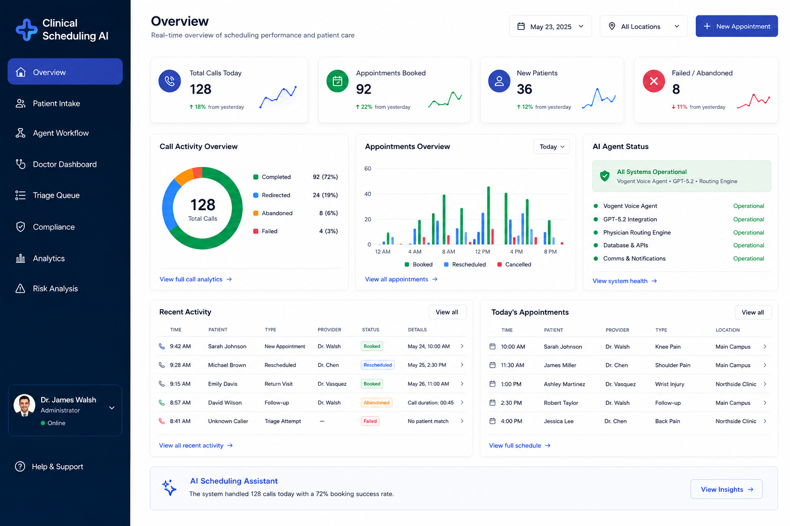

# AI Medical Scheduling Agent

A voice-ready medical scheduling platform built for a two-calendar-day engineering work trial. The system combines a Flask API, deterministic physician routing, PostgreSQL scheduling data, Vogent integration boundaries, a transactional booking workflow, and a polished React call-review dashboard.

The core design decision is deliberate: the conversational layer may collect and normalize caller information, but the backend domain layer is the final authority for physician eligibility, location validity, slot availability, and booking.



> The image above is the supplied visual reference. The application uses its layout and hierarchy as design direction without copying its branding.

## What was built

- Exact protocol encoding for 12 physicians, five clinic locations, all supplied specialist capabilities, and exactly
  one designated General Orthopedics physician: Dr. David Nguyen.
- Per-physician new-patient eligibility using patient-doctor treatment history.
- Deterministic routing with preferred-doctor validation, preferred-location-first handling, all-location fallback,
  top-three recommendations, real-slot lookup, and transactional fallback booking.
- Transactional appointment booking with a final eligibility check, row locking on PostgreSQL, a unique appointment-per-slot constraint, and conflict responses.
- Patient lookup and duplicate-safe creation.
- Call lifecycle, normalized transcript turns, appointment association, and explainable routing-audit records.
- Local call simulator that invokes the same routing and booking services used by the API and Vogent adapter.
- React/TypeScript dashboard with Overview, Calls, Call Detail, Appointments, Physicians, Routing Audit, and Call Simulator pages.
- Docker Compose development and single-EC2 production deployment with PostgreSQL, Gunicorn, Nginx, health checks, and a persistent database volume.
- Vogent function-call configuration blueprints, webhook adapter, HMAC verification, variable mapping, and credential-dependent setup instructions.
- GPT-5.2 Responses API adapter with strict structured-output validation and no mock fallback in live mode.
- PostgreSQL-only normal runtime guardrails; SQLite is allowed only for explicit test configuration.
- Backend request-size limits, field-level transcript/caller-text limits, and a DB-backed fixed-window limiter for public write/integration endpoints.
- Automated backend and frontend tests, including all required routing scenarios and concurrent booking protection.
- **Phase 2:** Complete web-based AI patient intake and scheduling experience using the same backend scheduling, routing, and validation logic as the voice calls.
- **Phase 2:** Dashboard updates for Web Chat Sessions and Patients, reusing React components and endpoints.
- **Phase 2:** Password-backed patient account foundation with hashed passwords, database-backed returning-patient login, profile email updates as the future login identifier, and latest unfinished chat-session recovery.

## Phase 2 URLs and Demo Credentials

- **Admin Dashboard URL:** `http://localhost:5173/`
- **Patient Entry URL:** `http://localhost:5173/sign-in?role=patient`
- **Patient Web Chat URL:** `http://localhost:5173/chat` or `http://localhost:5173/schedule` after a valid patient session exists.

**Demo Admin Credentials:**
- Name: Dr. James Walsh
- Email: `admin@example.com`
- Password: `admin123`

**Demo Returning Patient Credentials:**
- Name: Jordan Segovia
- Email: `jordan.patient@example.com`
- Password: `demo123`
- Identity fields: DOB: 1988-09-22, Phone: 805-264-4217

Jordan's weak password is synthetic demonstration data only. The seed stores it as a password hash, not plaintext.

**Supported functionality:**
- Happy paths for new and returning patient scheduling.
- Patient-first entry with distinct New patient and Returning patient paths before chat initialization.
- New-patient registration creates or reuses a validated synthetic patient record with normalized email and a securely hashed password before the scheduling transcript starts.
- New-patient passwords require 12-128 characters, may include spaces, are never trimmed or stored in plaintext, and must be confirmed in the registration form.
- Returning-patient authentication verifies the submitted email and password against the stored database hash before creating a signed browser session.
- The same patient credentials work after sign-out, browser changes, device changes, lost cookies, and idle-session expiration.
- Patient profile email updates become the future login identifier while preserving the existing password hash.
- Login restores the authenticated patient's latest unfinished scheduling session when one exists.
- Confirmed, emergency-escalated, care-team-handoff, abandoned, and other terminal chat sessions remain historical records instead of reopening as drafts.
- Dynamic personalized welcome messages are persisted once from the backend patient record: `Welcome, {first_name}. What is the reason for your visit today?` for new patients and `Welcome back, {first_name}. What is the reason for your visit today?` for returning patients.
- Conversational intake that stores transcript messages separately from structured intake data.
- Patient-facing chat refinement with a backend-derived progress dropdown, accessible textarea composer, auto-scroll, thinking state, retry-safe failed sends, and concise approved intake questions.
- OpenAI-backed structured intake through the Flask backend only, with deterministic backend validation and no browser-side OpenAI calls.
- Deterministic physician recommendations using the Phase 1 `PhysicianRoutingService`, real database slots, and transactional booking.
- Typo-tolerant normalization for common speech-like inputs such as `north clinc`, `east clinic`, `south clinic`, `ankle pain`, `this is a follow up yeah`, and `I being felling this way for about two weeks`, while preserving the original patient message in the transcript.
- Severity uses a 1-10 scale only. Values outside 1-10 are rejected without silently clamping or persisting the invalid value.
- Emergency escalation, including stopping scheduling, saving the trigger message, and marking the session as escalated.
- Care team handoff for explicit human requests, complex insurance/payment/billing questions, unsupported complaints, and repeated low-confidence interpretation.
- Browser refresh recovery for intake, recommendation, selected-slot, booking, and escalation states without regenerating welcome messages.
- Direct `/chat` navigation without a valid patient session redirects to patient entry instead of creating an anonymous intake.
- Patient account menu in the scheduling UI is backed by the authenticated server session and contains only Profile and Sign out.
- Patient profile at `/patient/profile` shows the authenticated Patient record, uses the persisted account-created timestamp, and allows only email and phone updates.
- Patient sign-out invalidates the server patient session, clears frontend patient/chat state, and preserves patients, transcripts, routing results, and appointments.
- Scheduling status is an accessible disclosure: collapsed mode shows only the current status label, while expanded mode reveals backend-derived progress and confirmed appointment details.
- Backend-enforced idle expiration uses `SESSION_IDLE_TIMEOUT_MINUTES` for patient and admin sessions and returns `SESSION_EXPIRED` after inactivity.
- Protected admin review pages for Web Chat Sessions and Patients.

**Intentionally Left Out:**
- HIPAA compliance features.
- Password reset, email verification, MFA, OAuth, SMS verification, and long-term account-management workflows.
- Appointment-history interface, cancellation, rescheduling, advanced concurrent-session management, and account-wide remote logout.
- Map distance, travel-time ranking, and "closest physician" claims.
- Payments, digital paperwork, reviews, and reminder workflows.
- Production-grade security hardening beyond the demo access gates and environment-based secrets.

For this work trial, the patient experience now includes a minimal persistent account foundation: normalized email, hashed password, server-side signed sessions, idle expiration, logout, and owned chat-session recovery. Production features such as password reset, email verification, MFA, OAuth, advanced concurrent-session controls, and account-wide remote logout remain deferred.

## Phase 2 Patient Workflow

1. Patient starts at `/sign-in?role=patient` and selects New patient or Returning patient.
2. Returning patients authenticate with stored email/password credentials before any new scheduling transcript is created.
3. New patients complete registration with first name, last name, date of birth, contact number, email, password, password confirmation, and insurance provider before any scheduling transcript is created.
4. The backend creates or reuses the validated synthetic patient record, links the chat session to that patient, stores `patient_type`, and persists exactly one personalized assistant welcome.
5. Successful login restores the latest patient-owned unfinished scheduling session. If none exists, the backend creates a new patient-owned scheduling session.
6. `/chat` and `/schedule` restore the authenticated browser's remembered session. Without one, they redirect to patient entry.
7. The patient can open the account menu to view the profile or sign out. Profile authorization is resolved from the server session, never from a frontend-supplied patient id.
8. The chat collects complaint, body part, side, duration, severity, appointment type, preferred location, preferred dates, preferred time of day, and preferred physician when supplied.
9. Deterministic backend validation rejects invalid future dates of birth, invalid severity values, unsupported categories, ambiguous required answers, and unsafe requests.
10. Once intake is complete, the backend calls the existing routing service and returns up to three eligible physicians with real open slots.
11. The patient selects an available time, reviews appointment details, and must explicitly confirm before booking.
12. Booking re-checks the slot and eligibility transactionally, links the appointment to the patient and chat session, and returns a confirmation only after commit.
13. After confirmation, the status disclosure remains visible and contains the confirmation summary and completed checklist without duplicating those details elsewhere.
14. Admin users can review the transcript, structured intake, routing path, escalation data, and appointment details in the existing dashboard.

## Architecture

```mermaid
flowchart LR
    Caller[Caller] --> Vogent[Vogent voice flow]
    Vogent --> Adapter[Flask Vogent adapter]
    Simulator[Local call simulator] --> API[Versioned Flask API]
    Adapter --> Domain[Deterministic domain services]
    API --> Domain
    Domain --> DB[(PostgreSQL)]
    Dashboard[React dashboard] --> API
    Nginx[Nginx] --> Dashboard
    Nginx --> API
    Dashboard --> WebChat[Patient Web Chat UI]
    WebChat --> API
    API --> AI_Intake[AI Intake Service (OpenAI GPT-5.2)]
    AI_Intake --> Domain
```

See [Architecture](docs/ARCHITECTURE.md), [ERD](docs/ERD.md), and [Routing Rules](docs/ROUTING_RULES.md) for the complete design.

## Technology stack

- Backend: Python 3.12+, Flask, SQLAlchemy 2.x, Alembic, PostgreSQL, Gunicorn, pytest, Ruff, mypy.
- Frontend: React, strict TypeScript, Vite, React Router, TanStack Query, Recharts, Vitest, Testing Library.
- Deployment: Docker, Docker Compose, Nginx, AWS EC2.
- Integration: Vogent function calls and signed webhooks behind an adapter boundary.

## Main scheduling flow

1. Identify or create the patient using phone and date of birth.
2. Collect patient status, body part, issue type, preferred physician, and preferred location.
3. Normalize supported caller language into canonical body-part and issue-type values.
4. Evaluate exact doctor capability rows.
5. Enforce new-patient eligibility per doctor using treatment history.
6. Prioritize valid preferred-doctor and preferred-location matches.
7. Query actual open slots and select the earliest deterministic recommendation.
8. Return up to three real-slot physician options, ranking exact specialists before General Orthopedics.
9. Repeat doctor, location, date, and time and require explicit confirmation.
10. Re-run eligibility and claim the slot transactionally.
11. Persist the appointment, transcript, call result, and routing decisions.

## Routing invariants

- `General` never matches `Fracture`, `Joint Replacement`, or `Sports Medicine`.
- A facility-returning patient is still new to a doctor they have never seen.
- A physician who does not accept new patients is eligible only when that patient has history with that physician.
- A slot is valid only at a location where the physician practices.
- Preferred doctors are validated rather than trusted.
- Preferred-location alternatives are explained and never booked without confirmation.
- Doctor ranking is deterministic: preferred physician when valid, specialist fit, preferred-location match, earliest slot, then doctor ID.
- General Orthopedics is a physician specialty, not the same thing as the canonical `General` issue type.
- Exactly one synthetic physician has broad General Orthopedics fallback coverage: Dr. David Nguyen.
- General Orthopedics fallback is included as at most one top-three card whenever Nguyen has a safe real slot.
- The API never reports a booking until the database transaction succeeds.

## General Orthopedics and Five-Location Rotation

Dr. David Nguyen is the single General Orthopedics physician. Specialists keep their accurate synthetic specialties and still require exact body-part and issue-type capability matches.

The seed creates deterministic clinic-local General Orthopedics availability across at least four future weeks:

- Monday: Main Campus
- Tuesday: East Clinic
- Wednesday: North Clinic
- Thursday: Westside Office
- Friday: South Clinic

The same seed also creates clinic-local specialist slots and closes only stale unbooked future seed slots. It never deletes confirmed appointments or reopens booked slots.

Supported location choices are Main, East, North, West, South, and earliest available at any location. The API presents locations in canonical order even when legacy database IDs differ.

## Repository structure

```text
.
├── backend/               Flask application, migrations, domain services, tests
├── frontend/              React dashboard and component tests
├── infra/                 Nginx and EC2 operational scripts
├── vogent/                Integration documentation and tool blueprints
├── docs/                  Architecture, API, ERD, deployment, demo, test plan
├── docker-compose.yml     Local development stack
├── docker-compose.prod.yml
├── Makefile
└── AGENTS.md
```

## Local setup with Docker

### Prerequisites

- Docker Engine with the Compose plugin
- Git

```bash
cp .env.example .env
docker compose up --build
```

The development stack is available at:

- Dashboard: `http://localhost:5173`
- API health: `http://localhost:8000/api/v1/health`

Migrations and idempotent seeding run when the backend container starts.

When changing backend environment values in the root `.env` after containers already exist, recreate the affected container so Docker injects the new values:

```bash
docker compose up -d --force-recreate backend
```

`docker compose restart backend` restarts the old container with its existing environment and may leave integration readiness stale.

## Local setup without Docker

Prerequisites: Python 3.12+, PostgreSQL 15+, Node.js 22+, and npm.

```bash
cp .env.example .env
python3 -m venv .venv
source .venv/bin/activate
pip install -e './backend[dev]'
cd frontend
npm ci
cd ..
```

Create a PostgreSQL database and set `DATABASE_URL` in `.env`, then run:

```bash
source .venv/bin/activate
set -a
source .env
set +a
cd backend
alembic upgrade head
flask --app app:create_app seed
gunicorn --bind 127.0.0.1:8000 --workers 2 --threads 2 app.wsgi:app
```

In a second terminal:

```bash
cd frontend
npm run dev
```

## Environment variables

Copy `.env.example` to `.env`. Never commit `.env`.

| Variable | Purpose |
|---|---|
| `APP_ENV` | `development`, `test`, or `production` |
| `SECRET_KEY` | Flask secret; use a generated production value |
| `POSTGRES_DB` | PostgreSQL database name |
| `POSTGRES_USER` | PostgreSQL user |
| `POSTGRES_PASSWORD` | PostgreSQL password |
| `DATABASE_URL` | SQLAlchemy database URL for non-Compose execution |
| `FRONTEND_ORIGIN` | Allowed browser origin |
| `PUBLIC_APP_URL` | Public application URL |
| `LOG_LEVEL` | Structured log level |
| `VOGENT_API_KEY` | Optional Vogent API credential |
| `VOGENT_WEBHOOK_SECRET` | Vogent webhook-signature secret |
| `VOGENT_FUNCTION_SECRET` | Shared secret sent by configured Vogent function calls |
| `VOGENT_AGENT_ID` | Optional Vogent agent identifier |
| `OPENAI_API_KEY` | Server-side OpenAI API credential; never expose to browser code |
| `OPENAI_MODEL` | Must be `gpt-5.2`; the backend does not silently substitute another model |
| `OPENAI_INTEGRATION_MODE` | `live` calls OpenAI and fails closed without a key; `test` uses deterministic fixtures |
| `OPENAI_TIMEOUT_SECONDS` | OpenAI request timeout |
| `OPENAI_MAX_RETRIES` | Bounded retry count for transient OpenAI failures |
| `MAX_CONTENT_LENGTH` | Flask request-body limit; default `262144` bytes |
| `JSON_STRING_FIELD_MAX_LENGTH` | Global JSON string limit; default `8192` characters |
| `RAW_USER_TEXT_MAX_LENGTH` | Caller utterance limit for OpenAI interpretation; default `4000` characters |
| `TRANSCRIPT_TURN_MAX_LENGTH` | Single transcript-turn text limit; default `2000` characters |
| `TRANSCRIPT_TURN_MAX_COUNT` | Transcript turns accepted per webhook payload; default `200` |
| `RATE_LIMIT_ENABLED` | Enables DB-backed fixed-window abuse limiter outside tests |
| `RATE_LIMIT_WINDOW_SECONDS` | Rate-limit window; default `60` seconds |
| `RATE_LIMIT_MAX_REQUESTS` | Protected POST requests per route/identifier/window; default `60` |
| `SESSION_IDLE_TIMEOUT_MINUTES` | Patient/admin idle timeout; default `60` minutes |
| `ALLOW_OPENAI_TEST_MODE_IN_PRODUCTION` | Must be `true` before production can start with `OPENAI_INTEGRATION_MODE=test` |

## Database migration and seed

```bash
make migrate
make seed
```

The seed is idempotent and includes:

- The supplied physician protocol plus a deterministic synthetic Foot/Ankle General coverage row for Dr. David Nguyen.
  This keeps common ankle-pain scheduling demonstrable without making knee-only or unrelated physicians eligible.
- Two weeks of realistic slots.
- Deliberately unavailable first choices for fallback demonstrations.
- Synthetic patients, including treatment history with Dr. Aisha Patel.
- Scheduled, redirected, abandoned, and failed calls.
- Existing appointments and routing-audit events.

Useful synthetic returning-patient demonstration:

- Name: Maya Patel
- Date of birth: `1982-11-06`
- Phone: `+18055550105`
- History: previously treated by Dr. Aisha Patel

## Tests and verification

With the Docker development stack running, use the Make targets. They execute inside the Compose services and do not require a root `.venv` on the host:

```bash
make test
make lint
make build
```

For a local non-Docker setup, use the same underlying commands in the host virtual environment:

```bash
source .venv/bin/activate
cd backend
pytest -q
ruff check .
ruff format --check .
mypy app
```

```bash
cd frontend
npm run lint
npm test -- --run
npm run build
```

The test suite covers Scenarios A-I, exact capability matching, per-doctor new-patient rules, fallback, location handling, API workflows, transcript persistence, routing audit, frontend states, and concurrent booking conflict behavior.

Phase 2 was additionally smoke-tested against the local Docker PostgreSQL database and configured OpenAI provider for:

- Patient entry with separate New patient and Returning patient paths before chat.
- Returning-patient authentication creates one persisted `Welcome back, Jordan...` transcript message and no generic new-or-returning question.
- New-patient registration creates or reuses the patient record and creates one persisted `Welcome, Jose...` transcript message.
- New-patient registration requires password and confirmation fields, rejects mismatches and short passwords, stores only a hash, and authenticates the new patient immediately.
- Returning-patient login verifies database-backed password hashes, uses the same generic failure for unknown email and wrong password, and never exposes password hashes in API responses.
- Same patient credentials continue working after logout, idle expiration, lost browser session, and independent browser/device sign-in without creating another patient record.
- Profile email updates become the future login identifier while keeping the stored password hash unchanged.
- Latest unfinished patient-owned chat sessions are restored after login without duplicating messages; confirmed, emergency-escalated, and care-team-handoff sessions are not restored as drafts.
- Failed registration and failed authentication do not create personalized welcome messages.
- Repeated initialization and refresh restoration do not duplicate welcome messages.
- Direct `/chat` without a valid patient session redirects to patient entry in frontend regression tests.
- Returning-patient scheduling with Jordan Segovia.
- Jordan Segovia right-knee sports-medicine follow-up at NORTH with earliest/morning preferences now routes to Dr. James Walsh at North Clinic with a real `2026-07-28T09:00:00+00:00` slot.
- New-patient scheduling with synthetic patient data.
- Invalid future date of birth and invalid severity rejection without saving the invalid value.
- Mid-conversation corrections and correction-event persistence.
- Off-topic redirect while preserving progress.
- Emergency escalation and exact trigger-message persistence.
- Human-transfer/care-team handoff.
- No eligible physician and no available slots.
- Sophia Martinez new-patient ankle-pain intake with preferred MAIN now searches Main Campus first, explains that no
  matching Main appointment is available, offers Dr. David Nguyen at North Clinic, and books only after confirmation.
- Slot taken before confirmation with refreshed alternatives.
- Browser refresh recovery during intake and slot selection.
- Unauthorized patient-session access rejection.
- Patient account menu rendering from the backend profile endpoint, with Profile and Sign out only.
- Scheduling-status disclosure hiding contact and appointment details when collapsed and restoring confirmed details when expanded.
- Patient profile authorization, persisted account-created timestamp labeling, email/phone updates, read-only field rejection, logout, and idle expiration.
- Admin idle expiration using the same configured timeout without exposing the patient session.
- Unauthenticated and authenticated admin dashboard API access.
- Mobile patient sign-in browser screenshot at 390 x 900.

Valid synthetic routing scenarios include:

- Jordan Segovia, returning patient, right knee sports injury, follow-up, NORTH, earliest/morning: Dr. James Walsh, North Clinic, real morning slots.
- Sophia Martinez, new patient, left ankle pain after twisting stepping off a curb, MAIN preferred, earliest available:
  Foot/Ankle General normalizes correctly, Main Campus is searched first, and Dr. David Nguyen at North Clinic is
  offered as an explicitly labeled alternative-location appointment.
- Knee sports medicine with preferred Dr. Maria Chen on the first future weekday date range: Dr. Chen is valid but has no slot in that range, so the fallback path recommends Dr. James Walsh.
- Shoulder fracture with preferred NORTH: Dr. Elena Vasquez is the valid physician, with a different approved location explained before booking.
- Unsupported or low-confidence complaints still stop automated scheduling and produce care-team handoff behavior.

## API overview

All application routes are under `/api/v1`.

- `GET /health`
- Patient lookup/create/read and appointment history
- Doctor, location, and protocol reads
- `POST /routing/recommendations`
- Open-slot query
- Transactional appointment create/read
- Call create/update/list/read and transcript append
- Dashboard overview and routing audit
- Simulator preview and booking
- Vogent function and webhook adapter routes
- Phase 2 patient chat:
  - `POST /api/chat/sessions`
    - Returning patient: verifies stored email/password credentials and creates/restores a patient-linked session.
    - New patient: validates registration details, hashes the submitted password, creates/reuses the patient account, and creates/restores a patient-linked session.
  - `POST /api/chat/sessions/<session_id>/patient-access`
  - `POST /api/chat/sessions/<session_id>/messages`
  - `GET /api/chat/sessions/<session_id>`
  - `POST /api/chat/sessions/<session_id>/appointments/confirm`
- Phase 2 patient account:
  - `GET /api/patient/profile`
  - `PATCH /api/patient/profile`
  - `POST /api/patient/logout`
- Phase 2 admin review:
  - `POST /api/auth/admin/login`
  - `GET /api/auth/admin/session`
  - `POST /api/auth/admin/logout`
  - `GET /api/v1/dashboard/chat-sessions`
  - `GET /api/v1/dashboard/chat-sessions/<session_id>`
  - `GET /api/v1/dashboard/patients`
  - `GET /api/v1/dashboard/patients/<patient_id>`

See [API documentation](docs/API.md) for request and response examples.

## Vogent setup

The repository does not claim a live credentialed Vogent connection. The integration is complete up to the workspace-specific configuration step:

1. Deploy the application to a public HTTPS endpoint.
2. Add the three HTTP function calls from `vogent/tool-definitions/` to the Vogent flow.
3. Configure `X-Vogent-Function-Secret` with the same value as the server environment.
4. Configure transcript/status webhooks to `/api/v1/vogent/webhooks`.
5. Set the webhook-signing secret in `VOGENT_WEBHOOK_SECRET`.
6. Build/import the flow nodes using `vogent/flow-export/flow-node-specs.json` and workspace-specific node IDs.
7. Run `PUBLIC_APP_URL=https://... VOGENT_FUNCTION_SECRET=... VOGENT_WEBHOOK_SECRET=... ./infra/scripts/verify-vogent-readiness.sh`.
8. Run the supplied scenario checklist in the Vogent test interface.

The JSON in `flow-node-specs.json` is a documented node blueprint, not a fabricated claim of a completed workspace export. See [Vogent integration documentation](vogent/README.md).

OpenAI first-live verification is intentionally manual and credential-gated:

```bash
OPENAI_API_KEY=<key> OPENAI_MODEL=gpt-5.2 OPENAI_INTEGRATION_MODE=live \
  ./infra/scripts/verify-openai-live.sh
```

That command performs one paid synthetic interpretation request against the backend. Do not run it until the reviewer/candidate intentionally adds the key.
If the key is added to root `.env` while Docker is already running, recreate `backend` before checking the dashboard readiness row.

## Docker production deployment

```bash
cp .env.example .env
# Set PostgreSQL values, a strong SECRET_KEY, and PUBLIC_APP_URL.
docker compose -f docker-compose.prod.yml up -d --build
```

Only Nginx publishes a host port. PostgreSQL remains on an internal Docker network with a named persistent volume. The backend runs Alembic, executes the idempotent seed, and starts Gunicorn. Production startup fails if `DATABASE_URL` is absent, non-PostgreSQL, if `SECRET_KEY` is still a development placeholder, or if OpenAI test mode is enabled without explicit approval.

See [EC2 deployment](docs/DEPLOYMENT.md) for security-group, installation, backup, restart, logs, health-check, and optional HTTPS instructions.

## AWS EC2 summary

Recommended work-trial deployment:

- One Ubuntu EC2 instance.
- Security group: SSH from the administrator IP; HTTP/HTTPS publicly accessible as required.
- Docker Engine and Compose plugin.
- Repository and `.env` on the instance.
- `docker compose -f docker-compose.prod.yml up -d --build`.
- Public access through the EC2 public DNS or IP; custom domain is optional.

For a production follow-up, move PostgreSQL to RDS or another managed database, put secrets in AWS Secrets Manager or Parameter Store, add automated backups, TLS, monitoring, authentication, and deployment automation.

## Deliberately skipped

These were omitted to protect the two-day work-trial priority: a reliable, explainable scheduling path.

- Full production authentication hardening, password reset, email verification, MFA, OAuth, advanced concurrent-session management, account-wide remote logout, and role-based authorization beyond the current demo gates.
- Multi-tenant organization management.
- Appointment-history interface, cancellation, and rescheduling workflows.
- Insurance verification, payments, and EHR integration.
- Waitlists and advanced calendar optimization.
- Editable physician protocol administration.
- Long-term call-audio storage.
- Managed RDS deployment and large-scale observability.

None of the required routing, slot lookup, booking, transcript, audit, dashboard, Docker, or integration-boundary functionality is represented as a deliberate skip.

## Known limitations

- A live Vogent call requires credentials and workspace configuration not stored in this repository.
- Normal runtime requires PostgreSQL. Automated tests use explicit SQLite only under `APP_ENV=test`; PostgreSQL-specific row locking remains part of the runtime booking path and is backed by a unique appointment-per-slot constraint.
- The abuse limiter is DB-backed fixed-window protection for the work-trial deployment. A longer-lived internet deployment should still add edge/WAF controls, authentication, and observability.
- Official Vogent docs reviewed do not document a signed timestamp header. Replay defense therefore uses persisted event keys/payload hashes plus terminal-state guards instead of an invented timestamp window.
- The production Compose file is designed for one EC2 host, not horizontal scaling.
- Authentication is intentionally lightweight for the work trial; the deployed demo should contain only synthetic data.
- Patient accounts support persistent email/password login, but password reset, email verification, MFA, OAuth, advanced concurrent-session controls, and account-wide remote logout are not implemented.
- Patient slot selection shows real date/time buttons and selected-slot review, but full calendar navigation and map-distance sorting are deferred.
- Browser verification used headless Chrome DOM/screenshot smoke checks plus API E2E flows, not a full Playwright interaction suite.
- The frontend production bundle includes Recharts and may benefit from route-level code splitting in a longer engagement.

## What would be done next

1. Run a credentialed Vogent end-to-end call and preserve its verified export.
2. Add password reset, email verification, MFA/OAuth options, RBAC, audit retention, edge rate limits, WAF rules, and security headers.
3. Move PostgreSQL to RDS with encrypted backups and private-subnet networking.
4. Integrate a real scheduling/EHR system behind the same domain contracts.
5. Add slot holds with expiration, cancellation/rescheduling, and notifications.
6. Add OpenTelemetry, centralized logs, alerts, and deployment automation.
7. Add map/travel-time ranking, full calendar navigation, route-level frontend code splitting, and deeper accessibility/browser testing.

## Submission checklist

- [x] Flask app factory and versioned Blueprints
- [x] Normalized scheduling schema and migration
- [x] Exact protocol seed and idempotent seed command
- [x] Deterministic routing and explainable rejection reasons
- [x] Real database slots and fallback behavior
- [x] Transactional booking and conflict protection
- [x] Durable caller confirmation required before booking
- [x] Calls, transcripts, appointment details, and routing audit
- [x] Polished React dashboard backed by the API
- [x] Backend-derived OpenAI/Vogent readiness statuses
- [x] Local simulator using production domain services
- [x] Vogent adapter, tool blueprints, signing validation, idempotency, and setup docs
- [x] GPT-5.2 structured-intent adapter path with mocked tests
- [x] Phase 2 patient web chat, session persistence, recommendations, booking, and admin review
- [x] Phase 2 patient password-account foundation and unfinished-session recovery
- [x] Docker Compose, Nginx, health checks, and EC2 instructions
- [x] Automated backend/frontend tests
- [x] Demo video script and final checklist
- [x] No secrets committed
- [ ] Workspace-specific Vogent credentials connected
- [ ] EC2 instance launched by the reviewer/candidate
- [ ] Final walkthrough video recorded by the candidate

## Official references

Architecture and operational choices are grounded in official documentation:

- Python: `https://docs.python.org/3/`
- Flask: `https://flask.palletsprojects.com/`
- SQLAlchemy: `https://docs.sqlalchemy.org/`
- Alembic: `https://alembic.sqlalchemy.org/`
- PostgreSQL: `https://www.postgresql.org/docs/`
- React: `https://react.dev/`
- TypeScript: `https://www.typescriptlang.org/docs/`
- Vite: `https://vite.dev/guide/`
- Docker: `https://docs.docker.com/`
- Nginx: `https://nginx.org/en/docs/`
- AWS EC2: `https://docs.aws.amazon.com/ec2/`
- pytest: `https://docs.pytest.org/`
- Vogent: `https://docs.vogent.ai/`
