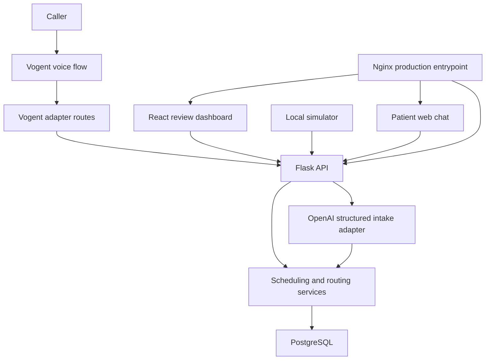

# AI Medical Scheduling Agent

A voice-ready and web-ready medical scheduling platform for orthopedic appointment booking. The system combines a Flask API, deterministic physician routing, PostgreSQL scheduling data, a transactional booking workflow, Vogent integration boundaries, OpenAI-backed intake interpretation, and a React review dashboard.

The central design rule is that conversational channels collect and normalize information, while backend domain services remain the authority for physician eligibility, patient-doctor history, location validity, slot availability, and appointment booking.

## What Is Included

- Flask application factory with versioned API routes.
- SQLAlchemy 2.x models and Alembic migrations for patients, physicians, locations, capabilities, slots, appointments, calls, transcripts, web chat sessions, confirmations, and integration logs.
- PostgreSQL-backed scheduling data with idempotent protocol and slot seeding.
- Deterministic physician routing using exact body-part and issue-type capability matches.
- Per-physician new-patient eligibility based on patient-doctor history.
- Real slot lookup, preferred physician validation, preferred location prioritization, and fallback recommendations.
- Transactional appointment booking with a final eligibility check and duplicate-slot protection.
- Call and web-chat transcript persistence for operational review.
- Vogent adapter endpoints and tool blueprints for voice scheduling integration.
- OpenAI GPT-5.2 structured intake adapter behind the Flask backend.
- React/TypeScript dashboard for calls, web chat sessions, patients, appointments, physicians, routing audit, and local simulation.
- Docker Compose configurations for local development and single-host production deployment.
- Backend and frontend tests covering routing, booking, account access, web chat, Vogent boundaries, and security checks.

## Product Boundary

This application schedules medical appointments. It does not diagnose, triage, recommend treatment, generate clinical notes, verify insurance, process payments, or claim HIPAA compliance. All committed patient data is synthetic demonstration data.

## Phase 2 URLs and Demo Credentials

- **Admin Dashboard URL:** `http://localhost:5173/`
- **Patient Entry URL:** `http://localhost:5173/sign-in?role=patient`
- **Patient Web Chat URL:** `http://localhost:5173/chat` or `http://localhost:5173/schedule` after a valid patient session exists.

**Demo Admin Credentials:**
- Name: Dr. James Walsh
- Email: `admin@example.com`
- Password: `admin123`

**Demo Returning Patient Credentials:**
- Name: Olivia Carter
- Email: `olivia.carter.phase2.demo@example.com`
- Password: `Patient!2026`
- Identity fields: DOB: 1993-06-12, Phone: 805-555-0187

Olivia's weak password is synthetic demonstration data only. The seed stores it as a password hash, not plaintext.

**Supported functionality:**
- Happy paths for new and returning patient scheduling.
- Patient-first entry with distinct New patient and Returning patient paths before chat initialization.
- New-patient registration creates or reuses a validated synthetic patient record with normalized email and a securely hashed password before the scheduling transcript starts.
- New-patient passwords require 12-128 characters, may include spaces, are never trimmed or stored in plaintext, and must be confirmed in the registration form.
- Returning-patient authentication verifies the submitted email and password against the stored database hash before creating a signed browser session.
- The same patient credentials work after sign-out, browser changes, device changes, lost cookies, and idle-session expiration.
- Patient profile email updates become the future login identifier while preserving the existing password hash.
- Login restores the authenticated patient's latest unfinished scheduling session when one exists.
- Confirmed, emergency-escalated, care-team-handoff, abandoned, and other terminal chat sessions remain historical records instead of reopening as drafts.
- Dynamic personalized welcome messages are persisted once from the backend patient record: `Welcome, {first_name}. What is the reason for your visit today?` for new patients and `Welcome back, {first_name}. What is the reason for your visit today?` for returning patients.
- Conversational intake that stores transcript messages separately from structured intake data.
- Patient-facing chat refinement with a backend-derived progress dropdown, accessible textarea composer, auto-scroll, thinking state, retry-safe failed sends, and concise approved intake questions.
- OpenAI-backed structured intake through the Flask backend only, with deterministic backend validation and no browser-side OpenAI calls.
- Deterministic physician recommendations using the Phase 1 `PhysicianRoutingService`, real database slots, and transactional booking.
- Typo-tolerant normalization for common speech-like inputs such as `north clinc`, `east clinic`, `south clinic`, `ankle pain`, `this is a follow up yeah`, and `I being felling this way for about two weeks`, while preserving the original patient message in the transcript.
- Severity uses a 1-10 scale only. Values outside 1-10 are rejected without silently clamping or persisting the invalid value.
- Emergency escalation, including stopping scheduling, saving the trigger message, and marking the session as escalated.
- Care team handoff for explicit human requests, complex insurance/payment/billing questions, unsupported complaints, and repeated low-confidence interpretation.
- Browser refresh recovery for intake, recommendation, selected-slot, booking, and escalation states without regenerating welcome messages.
- Direct `/chat` navigation without a valid patient session redirects to patient entry instead of creating an anonymous intake.
- Patient account menu in the scheduling UI is backed by the authenticated server session and contains only Profile and Sign out.
- Patient profile at `/patient/profile` shows the authenticated Patient record, uses the persisted account-created timestamp, and allows only email and phone updates.
- Patient sign-out invalidates the server patient session, clears frontend patient/chat state, and preserves patients, transcripts, routing results, and appointments.
- Scheduling status is an accessible disclosure: collapsed mode shows only the current status label, while expanded mode reveals backend-derived progress and confirmed appointment details.
- Backend-enforced idle expiration uses `SESSION_IDLE_TIMEOUT_MINUTES` for patient and admin sessions and returns `SESSION_EXPIRED` after inactivity.
- Protected admin review pages for Web Chat Sessions and Patients.

**Intentionally Left Out:**
- HIPAA compliance features.
- Password reset, email verification, MFA, OAuth, SMS verification, and long-term account-management workflows.
- Appointment-history interface, cancellation, rescheduling, advanced concurrent-session management, and account-wide remote logout.
- Map distance, travel-time ranking, and "closest physician" claims.
- Payments, digital paperwork, reviews, and reminder workflows.
- Production-grade security hardening beyond the demo access gates and environment-based secrets.

For this work trial, the patient experience now includes a minimal persistent account foundation: normalized email, hashed password, server-side signed sessions, idle expiration, logout, and owned chat-session recovery. Production features such as password reset, email verification, MFA, OAuth, advanced concurrent-session controls, and account-wide remote logout remain deferred.

## Phase 2 Patient Workflow

1. Patient starts at `/sign-in?role=patient` and selects New patient or Returning patient.
2. Returning patients authenticate with stored email/password credentials before any new scheduling transcript is created.
3. New patients complete registration with first name, last name, date of birth, contact number, email, password, password confirmation, and insurance provider before any scheduling transcript is created.
4. The backend creates or reuses the validated synthetic patient record, links the chat session to that patient, stores `patient_type`, and persists exactly one personalized assistant welcome.
5. Successful login restores the latest patient-owned unfinished scheduling session. If none exists, the backend creates a new patient-owned scheduling session.
6. `/chat` and `/schedule` restore the authenticated browser's remembered session. Without one, they redirect to patient entry.
7. The patient can open the account menu to view the profile or sign out. Profile authorization is resolved from the server session, never from a frontend-supplied patient id.
8. The chat collects complaint, body part, side, duration, severity, appointment type, preferred location, preferred dates, preferred time of day, and preferred physician when supplied.
9. Deterministic backend validation rejects invalid future dates of birth, invalid severity values, unsupported categories, ambiguous required answers, and unsafe requests.
10. Once intake is complete, the backend calls the existing routing service and returns up to three eligible physicians with real open slots.
11. The patient selects an available time, reviews appointment details, and must explicitly confirm before booking.
12. Booking re-checks the slot and eligibility transactionally, links the appointment to the patient and chat session, and returns a confirmation only after commit.
13. After confirmation, the status disclosure remains visible and contains the confirmation summary and completed checklist without duplicating those details elsewhere.
14. Admin users can review the transcript, structured intake, routing path, escalation data, and appointment details in the existing dashboard.

## Architecture


```mermaid
flowchart TB
    Caller["Caller"] --> Vogent["Vogent voice flow"]
    BrowserPatient["Patient web chat"] --> API["Flask API"]
    Dashboard["React review dashboard"] --> API
    Simulator["Local simulator"] --> API

    Vogent --> Adapter["Vogent adapter routes"]
    Adapter --> API
    API --> Domain["Scheduling and routing services"]
    API --> Intake["OpenAI structured intake adapter"]
    Intake --> Domain
    Domain --> Database["PostgreSQL"]

    Nginx["Nginx production entrypoint"] --> Dashboard
    Nginx --> BrowserPatient
    Nginx --> API
```

More detail is available in:

- [Architecture](docs/ARCHITECTURE.md)
- [API Reference](docs/API.md)
- [Entity Relationship Diagram](docs/ERD.md)
- [Routing Rules](docs/ROUTING_RULES.md)
- [Deployment Guide](docs/DEPLOYMENT.md)
- [Test Plan](docs/TEST_PLAN.md)

## Repository Structure

```text
.
├── backend/               Flask app, domain services, migrations, tests
├── frontend/              React dashboard and patient chat interface
├── infra/                 Nginx and deployment helper scripts
├── vogent/                Voice integration docs and tool definitions
├── docs/                  Technical architecture, API, deployment, QA docs
├── docker-compose.yml     Local development stack
├── docker-compose.prod.yml
└── Makefile
```

## Local Setup With Docker

Prerequisites:

- Docker Engine with the Compose plugin
- Git

```bash
cp .env.example .env
docker compose up --build
```

Local endpoints:

- Frontend: `http://localhost:5173`
- Backend health: `http://localhost:8000/api/v1/health`

The backend container runs migrations and idempotent seed data on startup.

When changing environment values after containers already exist, recreate the affected service so Docker injects the new values:

```bash
docker compose up -d --force-recreate backend
```

## Local Setup Without Docker

Prerequisites:

- Python 3.12+
- PostgreSQL 15+
- Node.js 22+
- npm

```bash
cp .env.example .env
python3 -m venv .venv
source .venv/bin/activate
pip install -e './backend[dev]'
cd frontend
npm ci
cd ..
```

Set `DATABASE_URL` in `.env`, then run:

```bash
source .venv/bin/activate
set -a
source .env
set +a
cd backend
alembic upgrade head
flask --app app:create_app seed
gunicorn --bind 127.0.0.1:8000 --workers 2 --threads 2 app.wsgi:app
```

In a second terminal:

```bash
cd frontend
npm run dev
```

## Environment Variables

Copy `.env.example` to `.env`. Never commit `.env`.

| Variable | Purpose |
|---|---|
| `APP_ENV` | `development`, `test`, or `production` |
| `SECRET_KEY` | Flask signing secret; use a generated production value |
| `POSTGRES_DB` | PostgreSQL database name |
| `POSTGRES_USER` | PostgreSQL user |
| `POSTGRES_PASSWORD` | PostgreSQL credential |
| `DATABASE_URL` | SQLAlchemy database URL for non-Compose execution |
| `FRONTEND_ORIGIN` | Allowed browser origin |
| `PUBLIC_APP_URL` | Public application URL |
| `LOG_LEVEL` | Structured log level |
| `VOGENT_API_KEY` | Optional Vogent API credential |
| `VOGENT_WEBHOOK_SECRET` | Vogent webhook-signature secret |
| `VOGENT_FUNCTION_SECRET` | Shared secret for configured Vogent function calls |
| `VOGENT_AGENT_ID` | Optional Vogent agent identifier |
| `OPENAI_API_KEY` | Server-side OpenAI credential; never expose to browser code |
| `OPENAI_MODEL` | Expected model name, currently `gpt-5.2` |
| `OPENAI_INTEGRATION_MODE` | `live` for OpenAI calls or `test` for deterministic fixtures |
| `OPENAI_TIMEOUT_SECONDS` | OpenAI request timeout |
| `OPENAI_MAX_RETRIES` | Bounded retry count |
| `MAX_CONTENT_LENGTH` | Flask request-body limit |
| `JSON_STRING_FIELD_MAX_LENGTH` | Global JSON string limit |
| `RAW_USER_TEXT_MAX_LENGTH` | Caller utterance limit for intake interpretation |
| `TRANSCRIPT_TURN_MAX_LENGTH` | Single transcript-turn text limit |
| `TRANSCRIPT_TURN_MAX_COUNT` | Transcript turns accepted per webhook payload |
| `RATE_LIMIT_ENABLED` | Enables DB-backed fixed-window rate limiting |
| `RATE_LIMIT_WINDOW_SECONDS` | Rate-limit window |
| `RATE_LIMIT_MAX_REQUESTS` | Protected POST requests per route/identifier/window |
| `SESSION_IDLE_TIMEOUT_MINUTES` | Patient/admin idle timeout |
| `ALLOW_OPENAI_TEST_MODE_IN_PRODUCTION` | Must be explicitly enabled before production can use test mode |

## Database

```bash
make migrate
make seed
```

The seed command is idempotent and creates:

- The configured physician protocol and practice locations.
- Exact physician capability rows.
- Synthetic patients and patient-doctor history.
- Realistic future slots.
- Sample calls, appointments, transcript turns, and routing decisions for dashboard review.

## Tests And Quality Checks

With Docker running:

```bash
make test
make lint
make build
```

For local non-Docker development, use the backend and frontend package commands directly:

```bash
cd backend
pytest -q
ruff check .
ruff format --check .
mypy app

cd ../frontend
npm test -- --run
npm run lint
npm run build
```

## Smoke Testing

The smoke script uses environment variables and does not store credentials in source control:

```bash
SMOKE_BASE_URL=http://localhost:8000/api \
SMOKE_PATIENT_EMAIL=<synthetic-patient-email> \
SMOKE_PATIENT_PASSWORD=<synthetic-patient-password> \
SMOKE_ADMIN_EMAIL=<admin-email> \
SMOKE_ADMIN_PASSWORD=<admin-password> \
python scripts/smoke/smoke_test.py
```

Use only synthetic patient accounts for smoke tests.

## Vogent Integration

The repository includes backend endpoints, security checks, idempotency handling, and tool blueprints for Vogent. Workspace-specific function IDs, webhook secrets, phone-number bindings, and final flow setup are configured outside source control.

See [Vogent integration documentation](vogent/README.md).

## OpenAI Intake

Patient-facing web chat calls OpenAI only through the Flask backend. The frontend never receives the OpenAI API key. Structured intake output is validated before deterministic backend routing or booking services are called.

Live OpenAI checks are credential-gated. Use the helper script only after providing credentials through environment variables:

```bash
OPENAI_API_KEY=<key> OPENAI_MODEL=gpt-5.2 OPENAI_INTEGRATION_MODE=live \
  ./infra/scripts/verify-openai-live.sh
```

## Production Deployment Overview

```bash
cp .env.example .env
# Set production environment values outside source control.
docker compose -f docker-compose.prod.yml up -d --build
```

The production Compose topology runs PostgreSQL, Gunicorn, and Nginx on a single host. Nginx is the public entrypoint. PostgreSQL is internal only and uses a named volume.

See [Deployment Guide](docs/DEPLOYMENT.md) for EC2 setup, security groups, restart commands, logs, health checks, backups, and optional HTTPS.

## Known Limitations

- Production authentication is intentionally minimal and should be hardened before real use.
- Password reset, MFA, OAuth, advanced role-based authorization, and account-wide logout are not implemented.
- Cancellation, rescheduling, reminders, billing, insurance verification, and EHR integration are not implemented.
- Vogent live operation requires external workspace credentials and flow configuration.
- Large-scale production concerns such as managed databases, observability, WAF rules, and automated backups are documented as next steps.

## Next Engineering Priorities

1. Complete a credentialed Vogent end-to-end call in the target workspace.
2. Harden authentication and authorization for a real deployment.
3. Move PostgreSQL to managed private infrastructure.
4. Add cancellation, rescheduling, reminders, and slot holds.
5. Add production observability, audit retention, and automated deployment checks.
