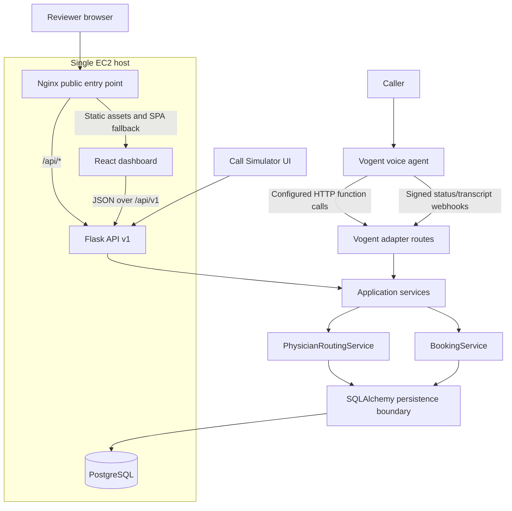
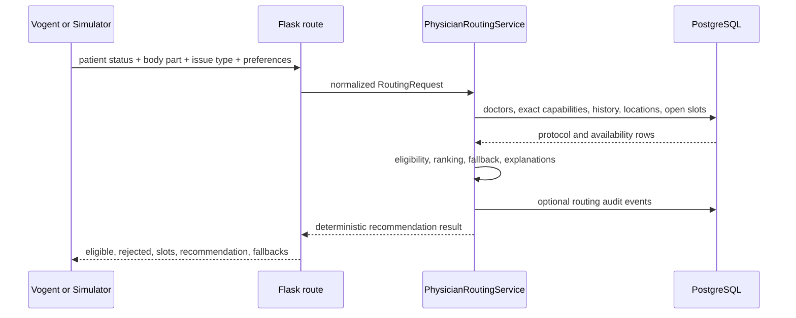
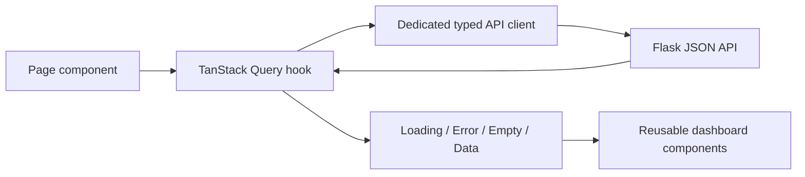
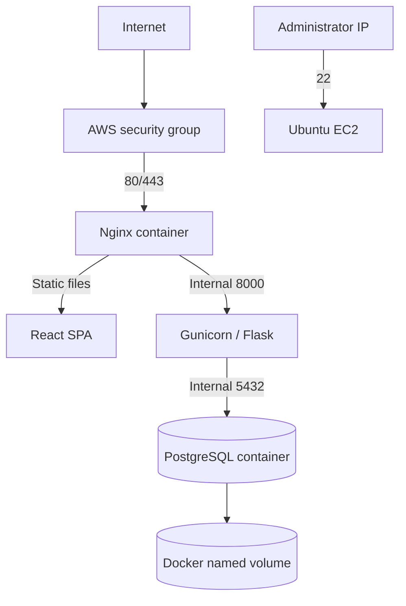

# Architecture

## Goals

The architecture optimizes for the work-trial signals that matter most: correctness, deterministic behavior, explainability, testability, and a small deployment surface. The conversational system is an input/output adapter. It is not the authority for clinical scheduling protocol.

## System diagram



## Component responsibilities

### React frontend

- Presents the operational dashboard and simulator.
- Uses a dedicated API client and TanStack Query for server state.
- Renders only backend-derived calls, appointments, physicians, metrics, and audit events.
- Converts API states into loading, empty, success, validation, and error UI.
- Does not implement protocol rules or make eligibility decisions.

### Nginx

- Is the only public container in production.
- Serves the compiled Vite application.
- Applies SPA history fallback.
- Proxies `/api/` to Gunicorn.
- Keeps PostgreSQL and backend ports off the public host interface.

### Flask API

- Uses an application factory and versioned Blueprints.
- Validates transport-level input.
- Enforces request-body and field-size limits before public write paths reach service code.
- Applies a DB-backed fixed-window rate limiter to appointment, confirmation, patient creation, conversation, Vogent function, and Vogent webhook POST routes.
- Delegates protocol decisions to domain services.
- Provides consistent JSON errors with request IDs.
- Separates Vogent payload translation from stable internal contracts.

### Deterministic domain layer

`PhysicianRoutingService` owns:

- Body-part and issue-type normalization.
- Exact capability matching.
- Per-doctor new-patient eligibility.
- Patient-doctor history evaluation.
- Preferred-doctor validation.
- Preferred-location priority and alternative explanation.
- Open-slot lookup.
- Stable ranking and fallback selection.
- Human-readable acceptance and rejection reasons.

`BookingService` owns:

- Durable caller-confirmation validation.
- Final patient and slot validation.
- Re-running physician eligibility at booking time.
- PostgreSQL row locking for the selected slot.
- A final status check.
- Appointment creation and slot status transition.
- Unique-constraint conflict translation.
- Call association and patient-doctor history update.

`BookingConfirmationService` owns:

- Persisting explicit caller confirmation for the exact call, patient, physician, location, slot, date/time, body part, and issue type.
- Rejecting missing, stale, expired, used, or mismatched confirmation tokens.
- Revalidating deterministic routing before booking can proceed.

`ConversationOrchestrator` and the OpenAI integration own caller-intent extraction only. They validate GPT-5.2 structured outputs and then call deterministic backend routing. They do not select final physicians, hold slots, or book appointments.

### Database layer

SQLAlchemy models represent normalized protocol, patient, scheduling, call, transcript, and audit data. PostgreSQL enforces the most important booking invariant with a unique appointment constraint on `slot_id`.

Normal runtime is PostgreSQL-only. Missing `DATABASE_URL` fails at startup, production rejects non-PostgreSQL database URLs, and SQLite is permitted only for explicit `APP_ENV=test` test runs.

### Vogent adapter boundary

The adapter translates configured Vogent function-call inputs into internal routing and booking requests. It:

- Authenticates function calls with a configured shared header.
- Verifies signed webhooks with HMAC-SHA256 when a webhook secret is configured.
- Stores idempotency records for function-call retries and webhook replay protection.
- Uses persisted event keys and payload hashes for replay detection; official Vogent docs reviewed do not document a signed timestamp header, so no invented replay-window header is enforced.
- Requires `confirm-slot` before `book-appointment`.
- Prevents stale status events from overwriting terminal call state.
- Avoids leaking Vogent-specific field structures into domain services.
- Returns caller-safe summaries instead of internal reason codes or stack traces.

## Request flows

### Routing request



### Booking request

```mermaid
sequenceDiagram
    participant Client
    participant API
    participant Confirm as BookingConfirmationService
    participant Booking as BookingService
    participant Router as PhysicianRoutingService
    participant DB as PostgreSQL

    Client->>API: explicit selected doctor + location + slot + request context
    API->>Confirm: persist caller confirmation
    Confirm->>Router: re-evaluate exact eligibility
    Confirm->>DB: store confirmation token
    API-->>Client: confirmation token
    Client->>API: booking request + confirmation token
    API->>Booking: booking command
    Booking->>Confirm: validate token and selected details
    Booking->>DB: BEGIN; SELECT slot FOR UPDATE
    Booking->>Router: re-evaluate exact eligibility
    Router->>DB: protocol + patient history
    Booking->>DB: verify OPEN and location relationship
    Booking->>DB: INSERT appointment; UPDATE slot BOOKED
    Booking->>DB: mark confirmation used; update call and patient-doctor history
    Booking->>DB: COMMIT
    Booking-->>API: confirmation object
    API-->>Client: 201 Created
```

Exactly one transaction succeeds when concurrent requests target the same slot. The row lock provides serialized access on PostgreSQL, while the unique `appointments.slot_id` constraint remains the final database-level invariant.

## Frontend data flow



Raw `fetch` calls are isolated in `frontend/src/api/`. Page components consume typed methods and do not duplicate transport logic.

## Deployment architecture



The work-trial deployment intentionally uses one EC2 instance. PostgreSQL has no public port. A production follow-up would move the database to RDS and add managed secrets, private subnets, TLS automation, monitoring, and backups.
